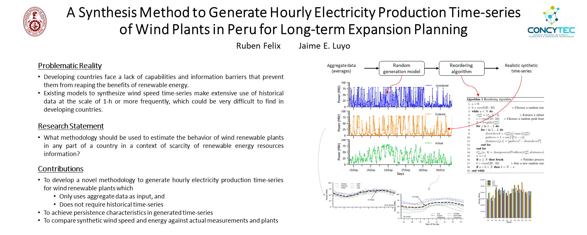
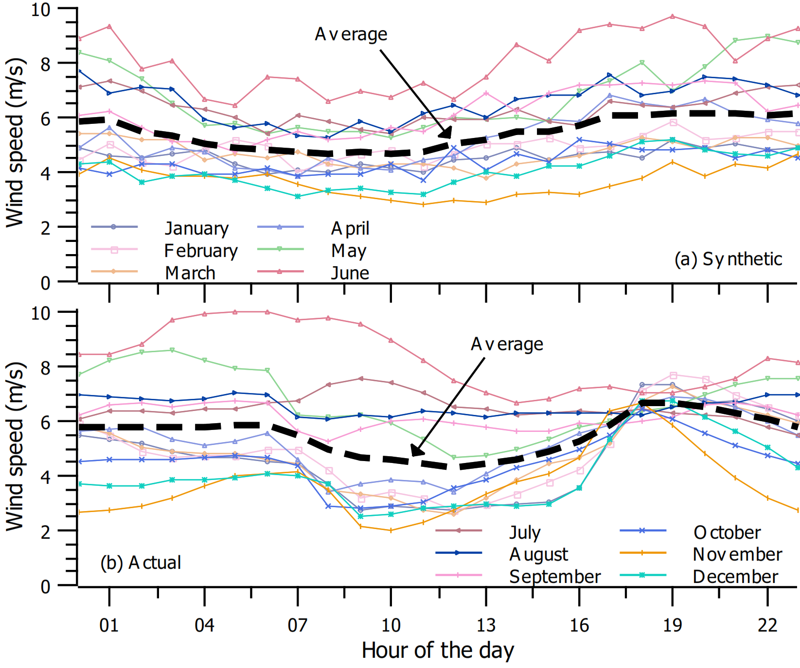
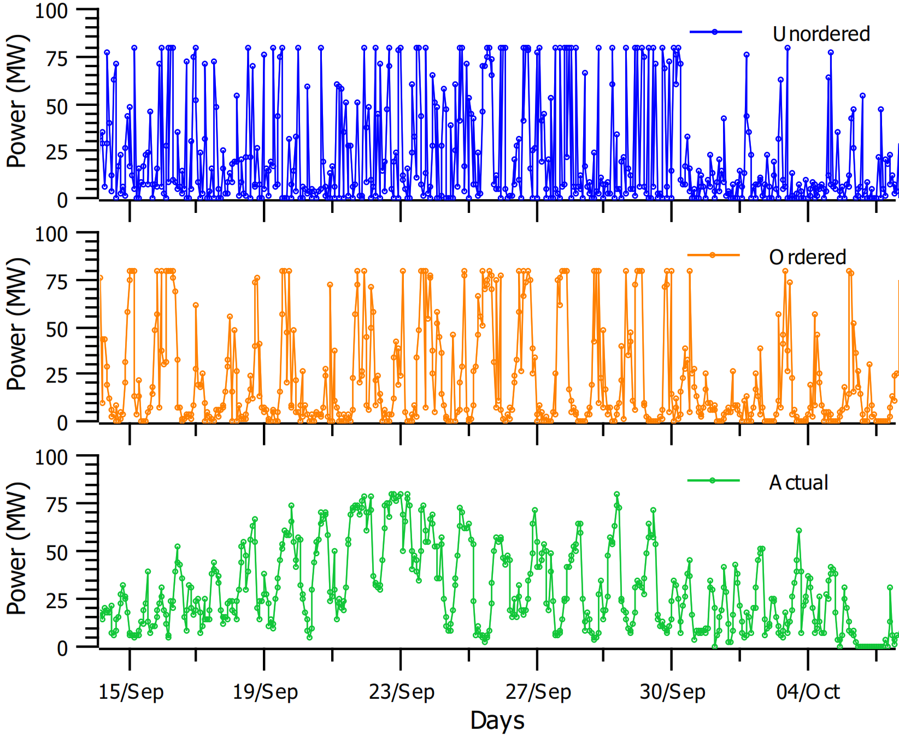

# Apps for Synthesizing Hourly Electricity Production Time-series of Wind Plants for Long-term Expansion Planning

Resources and extra documentation for the manuscript "A Synthesis Method to Generate Hourly Electricity Production Time-series of Wind Plants in Peru for Long-term Expansion Planning" published in IEEE Latin America Transactions.

The apps are organized by the type of software or programming language used in the project in the following order `Excel -> Python`. The project hierarchy description is as follows:

1. **EXCEL**:
    1. `APP-Synthesis-Wind-India.xlsx` Excel file which generates synthetically unordered speed values, and calculated the power produced by a wind turbine.
    2. `generated.csv` CSV file which extracts the unordered wind speed time-series generated with the previous file.
    3. `compared.csv` CSV file which contains the output power produced when used the unordered, ordered and actual wind speed time-series.
2. **PYTHON**:
    1. `APP_Reordering_Wind.ipynb` Python file which implements the reordering algorithm and plot a comparative graph.
    2. `final.csv` CSV file which saves the ordered wind speed time-series generated with the previous file.
  
## Requirements
- Excel add-on [NTRand](http://www.ntrand.com/) by *Numerical Technologies*.

## Screenshots

  
  

